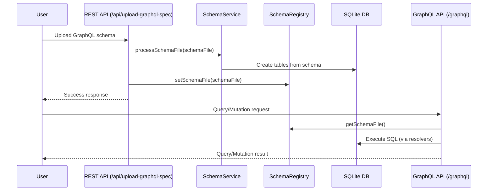

# GraphQL Sandbox

**Project managed by Digital API Corp**

This project is an open-source Spring Boot server that dynamically generates a GraphQL API and an SQLite database from an uploaded GraphQL schema. It allows you to upload a `.graphql` spec, automatically creates the corresponding database tables, and exposes a `/graphql` endpoint for queries and mutations.

## High-Level Flow



## Features
- Upload a GraphQL schema and auto-generate database tables
- Dynamic GraphQL endpoint based on uploaded schema
- Query and mutate data via GraphQL
- REST API for schema upload
- Multi-module architecture with database adapters
- Support for SQLite and PostgreSQL databases
- Code coverage and CI via GitHub Actions

## Getting Started

### Prerequisites
- Java 17+
- Maven

### Project Structure
The project is organized as a multi-module Maven project:
- `graphql-core` - Core GraphQL functionality and business logic
- `sqlite-adapter` - SQLite database adapter implementation
- `postgres-adapter` - PostgreSQL database adapter implementation  
- `graphql-app` - Executable Spring Boot application

### Database Configuration
The application supports multiple database backends:
- **SQLite** (default): File-based database, no setup required
- **PostgreSQL**: Requires a running PostgreSQL instance

### Setup
1. Clone the repository:
   ```bash
   git clone https://github.com/digitalapicraft/graphql-sandbox.git
   cd graphql-sandbox
   ```
2. Build the project:
   ```bash
   ./mvnw clean install
   ```
3. Run the server:
   ```bash
   # Option 1: Using the run.sh script (recommended)
   ./run.sh                    # Run with SQLite profile on port 8080
   ./run.sh postgres          # Run with PostgreSQL profile on port 8080
   ./run.sh sqlite 8081       # Run with SQLite profile on port 8081
   
   # Option 2: Using Maven directly
   ./mvnw spring-boot:run -pl graphql-app
   ```

### Usage
1. **Upload a GraphQL schema:**
   ```bash
   curl -F "file=@/path/to/your/schema.graphql" http://localhost:8080/api/upload-graphql-spec
   ```
2. **Query the GraphQL endpoint:**
   Send POST requests to `http://localhost:8080/graphql` with a JSON body:
   ```json
   { "query": "{ books { id title author } }" }
   ```

## API Endpoints
- `POST /api/upload-graphql-spec` — Upload a GraphQL schema file
- `POST /graphql` — Execute GraphQL queries and mutations

## Testing
Run all tests and generate a code coverage report:
```bash
./mvnw test
```
The coverage report will be available in `target/site/jacoco/index.html`.

## How to Contribute

We welcome contributions from the community! To help us review and merge your changes efficiently, please follow these guidelines:

### 1. Fork and Branch
- Fork the repository and create a new branch for your feature or bugfix.

### 2. Create a Pull Request (PR)
- Push your branch to your fork and open a [Pull Request](https://github.com/digitalapicraft/graphql-sandbox/pulls) against the `main` branch.
- Clearly describe your changes and reference any related issues or discussions.

### 3. Add Discussion Notes
- If your PR introduces a significant change, please start a [Discussion](https://github.com/digitalapicraft/graphql-sandbox/discussions) and link it in your PR description.
- For questions, ideas, or proposals, use the [Discussions](https://github.com/digitalapicraft/graphql-sandbox/discussions) tab.

### 4. General Guidelines
- Ensure your code passes all tests (`./mvnw test`) and follows the project's style.
- Add or update documentation as needed.
- Keep PRs focused and minimal—one feature or fix per PR is preferred.
- Be respectful and constructive in all communications.

## Contributing
Contributions are welcome! Please open issues or pull requests for improvements or bug fixes.

_This project is managed and maintained by **Digital API Corp**._

## License
This project is licensed under the MIT License. See [LICENSE](LICENSE) for details.

## Packaging and Running the Application

To build and run the application as a standalone JAR, use the provided script:

```bash
./package-and-run.sh [profile] [extra-args...]
```
- `profile` (optional): The Spring profile to use (`sqlite` by default, or `postgres` for PostgreSQL)
- `extra-args...` (optional): Any additional arguments to pass to the Spring Boot application (e.g., `--server.port=8081`)

**Examples:**

- Run with SQLite (default):
  ```bash
  ./package-and-run.sh
  ```
- Run with PostgreSQL:
  ```bash
  ./package-and-run.sh postgres
  ```
- Run with SQLite on a custom port:
  ```bash
  ./package-and-run.sh sqlite --server.port=8081
  ```

The script will:
1. Build the latest JAR for `graphql-app` (and dependencies)
2. Run it with your chosen profile and arguments 