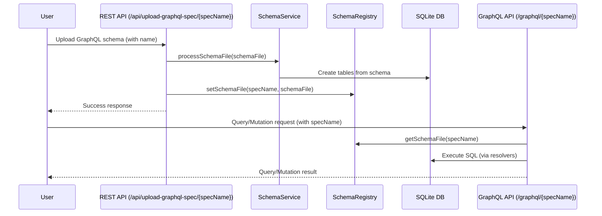

# GraphQL Sandbox

**Project managed by Digital API Corp**

This project is an open-source Spring Boot server that dynamically generates a GraphQL API and an SQLite or PostgreSQL database from uploaded GraphQL schemas. It now supports **multiple schemas**, each identified by a name, and exposes dynamic endpoints for each schema.

## High-Level Flow



## Features
- Upload multiple GraphQL schemas, each with a unique name
- Dynamic GraphQL endpoints per schema: `/graphql/{specName}`
- Query and mutate data via GraphQL for each schema
- REST API for schema upload: `/api/upload-graphql-spec/{specName}`
- Multi-module architecture with database adapters
- Support for SQLite and PostgreSQL databases
- In-memory mapping of spec names to schema files for fast access
- Integration and unit tests with Spring Boot and MockMvc

## Getting Started

### Prerequisites
- Java 17+
- Maven

### Project Structure
The project is organized as a multi-module Maven project:
- `graphql-core` - Core GraphQL functionality and business logic
- `sqlite-adapter` - SQLite database adapter implementation
- `postgres-adapter` - PostgreSQL database adapter implementation  
- `graphql-app` - Executable Spring Boot application

### Database Configuration
The application supports multiple database backends:
- **SQLite** (default): File-based database, no setup required
- **PostgreSQL**: Requires a running PostgreSQL instance

### Setup
1. Clone the repository:
   ```bash
   git clone https://github.com/digitalapicraft/graphql-sandbox.git
   cd graphql-sandbox
   ```
2. Build the project:
   ```bash
   ./mvnw clean install
   ```
3. Run the server:
   ```bash
   # Option 1: Using the run.sh script (recommended)
   ./run.sh                    # Run with SQLite profile on port 8080
   ./run.sh postgres          # Run with PostgreSQL profile on port 8080
   ./run.sh sqlite 8081       # Run with SQLite profile on port 8081
   
   # Option 2: Using Maven directly
   ./mvnw spring-boot:run -pl graphql-app
   ```

## Usage

### 1. **Upload a GraphQL schema**

```bash
curl -F "file=@/path/to/your/employee.graphql" http://localhost:8080/api/upload-graphql-spec/employee
curl -F "file=@/path/to/your/accounts.graphql" http://localhost:8080/api/upload-graphql-spec/accounts
```

### 2. **Query a specific schema**

Send POST requests to the dynamic endpoint:

```bash
curl -X POST http://localhost:8080/graphql/employee \
  -H 'Content-Type: application/json' \
  -d '{"query": "{ employees { id name } }"}'

curl -X POST http://localhost:8080/graphql/accounts \
  -H 'Content-Type: application/json' \
  -d '{"query": "{ accounts { id balance } }"}'
```

### 3. **Error Handling**
- If you query or upload with a non-existent spec name, you will receive a 404 error.

## Integration Testing

Integration tests use Spring Boot's `@SpringBootTest` and `@AutoConfigureMockMvc` to test the full application context and HTTP endpoints. Tests:
- Upload schemas via `/api/upload-graphql-spec/{specName}`
- Query each schema via `/graphql/{specName}`
- Verify correct data and error handling

**Example (Java):**
```java
@SpringBootTest
@AutoConfigureMockMvc
@ActiveProfiles("sqlite")
class GraphQLMultiSchemaIntegrationTest {
    @Autowired
    private MockMvc mockMvc;

    @Test
    void uploadAndQueryMultipleSchemas() throws Exception {
        // Upload and query logic here (see codebase for details)
    }
}
```

**Best Practices:**
- Use a test profile/database (e.g., SQLite)
- Clean up uploaded files after tests
- Test both success and error scenarios

## API Endpoints
- `POST /api/upload-graphql-spec/{specName}` — Upload a GraphQL schema file for a given name
- `POST /graphql/{specName}` — Execute GraphQL queries and mutations for a given schema

## Testing
Run all tests and generate a code coverage report:
```bash
./mvnw test
```
The coverage report will be available in `target/site/jacoco/index.html`.

## How to Contribute

We welcome contributions from the community! To help us review and merge your changes efficiently, please follow these guidelines:

### 1. Fork and Branch
- Fork the repository and create a new branch for your feature or bugfix.

### 2. Create a Pull Request (PR)
- Push your branch to your fork and open a [Pull Request](https://github.com/digitalapicraft/graphql-sandbox/pulls) against the `main` branch.
- Clearly describe your changes and reference any related issues or discussions.

### 3. Add Discussion Notes
- If your PR introduces a significant change, please start a [Discussion](https://github.com/digitalapicraft/graphql-sandbox/discussions) and link it in your PR description.
- For questions, ideas, or proposals, use the [Discussions](https://github.com/digitalapicraft/graphql-sandbox/discussions) tab.

### 4. General Guidelines
- Ensure your code passes all tests (`./mvnw test`) and follows the project's style.
- Add or update documentation as needed.
- Keep PRs focused and minimal—one feature or fix per PR is preferred.
- Be respectful and constructive in all communications.

## Contributing
Contributions are welcome! Please open issues or pull requests for improvements or bug fixes.

_This project is managed and maintained by **Digital API Corp**._

## License
This project is licensed under the MIT License. See [LICENSE](LICENSE) for details.

## Packaging and Running the Application

To build and run the application as a standalone JAR, use the provided script:

```bash
./package-and-run.sh [profile] [extra-args...]
```
- `profile` (optional): The Spring profile to use (`sqlite` by default, or `postgres` for PostgreSQL)
- `extra-args...` (optional): Any additional arguments to pass to the Spring Boot application (e.g., `--server.port=8081`)

**Examples:**

- Run with SQLite (default):
  ```bash
  ./package-and-run.sh
  ```
- Run with PostgreSQL:
  ```bash
  ./package-and-run.sh postgres
  ```
- Run with SQLite on a custom port:
  ```bash
  ./package-and-run.sh sqlite --server.port=8081
  ```

The script will:
1. Build the latest JAR for `graphql-app` (and dependencies)
2. Run it with your chosen profile and arguments 

## Running with Docker Compose

You can run the entire stack (GraphQL server + PostgreSQL) using Docker Compose. This is the easiest way to get started with a production-like environment.

### 1. Create a `.env` file

Create a `.env` file in the project root with the following content (edit values as needed):

```
POSTGRES_USER=graphql
POSTGRES_PASSWORD=graphqlpass
POSTGRES_DB=graphql_db
SPRING_DATASOURCE_URL=jdbc:postgresql://postgres:5432/graphql_db
SPRING_DATASOURCE_USERNAME=graphql
SPRING_DATASOURCE_PASSWORD=graphqlpass
SPRING_PROFILES_ACTIVE=postgres
```

### 2. Build the application JAR

Before running Docker Compose, build the application JAR:

```bash
./mvnw clean package -DskipTests
```

### 3. Start the stack

```bash
docker compose up --build
```

- The GraphQL server will be available at [http://localhost:8080](http://localhost:8080)
- PostgreSQL will be available at `localhost:5432` (for tools/clients)

### 4. Stopping the stack

To stop and remove containers, networks, and volumes:

```bash
docker-compose down -v
```

### 5. Notes
- The application will start with the `postgres` profile by default (see `Dockerfile`).
- You can modify the `.env` file to change database credentials or ports as needed.
- The database data is persisted in a Docker volume (`pgdata`).
- For schema upload and GraphQL queries, use the same endpoints as described above. 

## Restricting Swagger UI Access by URL and IP Address

You can restrict access to the Swagger UI to specific URLs and IP addresses using configuration in `application.properties`:

```
# Comma-separated list of Swagger UI URLs to restrict (default: /swagger-ui/)
app.swagger-ui.allowed-urls=/swagger-ui/
# Comma-separated list of allowed IP addresses (default: empty means allow all)
app.swagger-ui.allowed-ips=
```

- By default, all IP addresses are allowed (the property is empty).
- To restrict access, set `app.swagger-ui.allowed-ips` to a comma-separated list of allowed IPs (e.g., `192.168.1.100,10.0.0.1`).
- You can also change the URLs to protect by editing `app.swagger-ui.allowed-urls`.

**Example:**
```
app.swagger-ui.allowed-urls=/swagger-ui/,/swagger-ui.html
app.swagger-ui.allowed-ips=192.168.1.100,10.0.0.1
```

After updating the configuration, restart your application for changes to take effect.

You will need to implement a filter or use Spring Security to enforce these restrictions in your application code. 